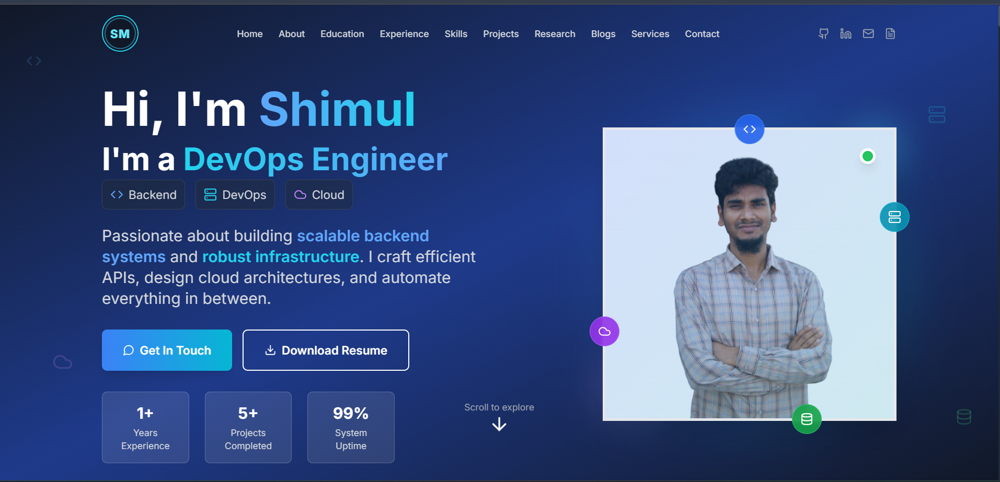

# 💫 About Me:
As a passionate Software and DevOps Engineer, I specialize in building and automating cloud-native systems. In my current role as a Junior DevOps Engineer at Anwar Group of Industries, I develop Kubernetes Custom Operators with Golang that have **reduced manual integration tasks by 80%**.

I also design and implement CI/CD pipelines (Jenkins) and monitoring stacks (Prometheus, Grafana), contributing to a **20% reduction in cloud storage costs**. I am a graduate of CUET (B.Sc. in CSE) and an **OCI Certified Architect Associate**, with a strong interest in MLOps and scalable system design.

---

# 👨‍💻 Current Work
- Building **Kubernetes Custom Operators** with **Golang** to simplify cloud-native workloads  
- Designing and managing **scalable SaaS infrastructure**  
- Automating **CI/CD pipelines** using **Jenkins, GitLab, and GitHub Actions**  
- Collaborating to **optimize and scale backend systems**  
- Exploring **MLOps, Microservices, and System Design** to drive smarter, more reliable applications  

---

# 💻 Technical Stack

| Category | Tools & Technologies |
|----------|--------------------|
| **Programming** |       |
| **Frameworks & Databases** |       |
| **Cloud & IaC** |      |
| **DevOps Tools** |         |

---

# 🧠 Publications

| Title | Conference / Journal | DOI / Link |
|-------|--------------------|------------|
| **Labour Care: A Garment Worker Assistance Mobile Application** | IEEE 8th International Conference on CSITSS 2024 | [DOI: 10.1109/CSITSS64042.2024.10816996](https://doi.org/10.1109/CSITSS64042.2024.10816996) |
| **A Smart System for Monthly Electrical Energy Consumption Prediction Using Machine Learning** | IJIEEB, Vol.16 No.6, Dec 2024 | [DOI: 10.5815/ijieeb.2024.06.04](https://doi.org/10.5815/ijieeb.2024.06.04) |

---

# 🏆 Achievements & Certifications

| Achievement / Certification | Platform / Issuer | Link |
|-----------------------------|-----------------|------|
| 🥇 **Oracle Cloud Infrastructure 2025 Certified Foundations Associate** | Oracle | [View Certificate](https://catalog-education.oracle.com/ords/certview/sharebadge?id=15E29E0E3F64FCA5A15F68B8D8C131999DF9C15A0409F5FA87DDED4A04FFF8E5) |
| 🥈 **Oracle Cloud Infrastructure 2025 Certified Architect Associate** | Oracle | [View Certificate](https://catalog-education.oracle.com/ords/certview/sharebadge?id=9655FEE6D8551666109DE5948A77D8F06A20EB21AF2096D2CAEB3B3C1723C89E) |
| **Data Structures & Algorithmic Problem Solving** | LeetCode • Codeforces • Stopstalk | [LeetCode](https://leetcode.com/__Depressed_021/) • [Codeforces](https://codeforces.com/profile/__Depressed_021/) • [Stopstalk](https://www.stopstalk.com/user/profile/__Depressed_021) |
| **Machine Learning Specialization** | Coursera | [View Certificate](https://www.coursera.org/account/accomplishments/specialization/5SUFTEJVHQJH) |

---

# 📊 GitHub Stats
  
  

---

# 🌐 Connect with Me

